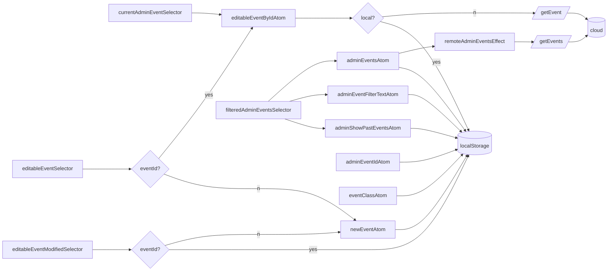
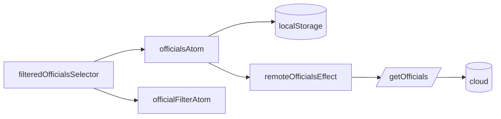
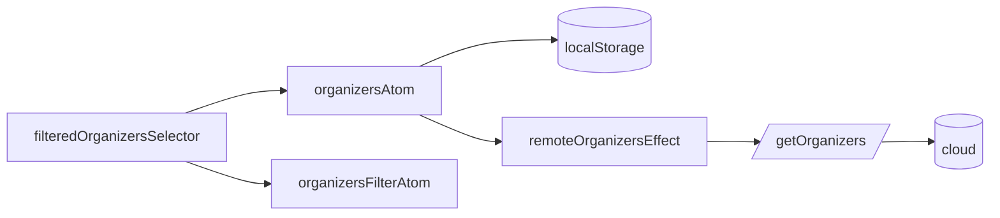
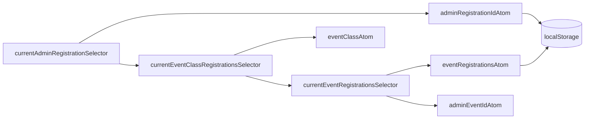

# State available to authenticated users

These flowcharts describes the relationship between atoms, selectors, effects and persistent storage.

## Events

## Officials

## Organizers

## Registrations

