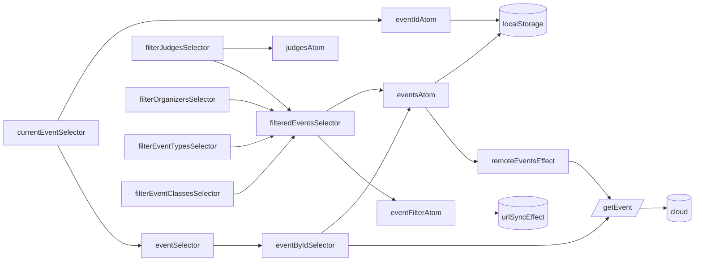
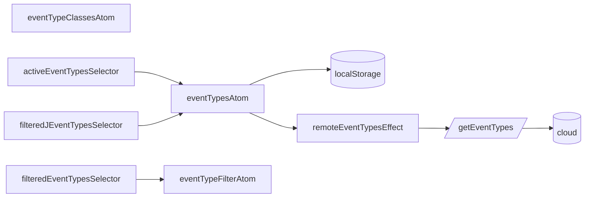
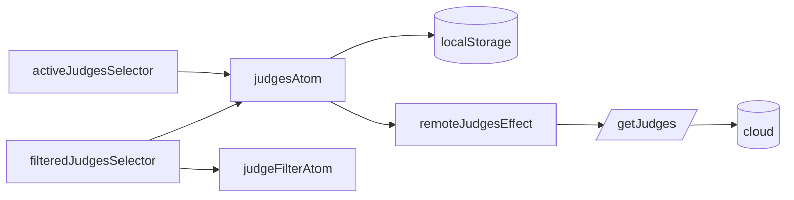
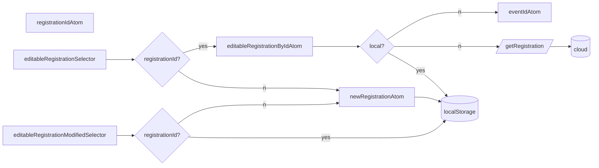

# State available to everyone

These flowcharts describes the relationship between atoms, selectors, effects and persistent storage.

## Events

```mermaid
graph LR
  eventIdAtom-->storageEffect
  eventsAtom-->storageEffect
  eventsAtom-->remoteEventsEffect
  eventFilterAtom-->urlSyncEffect

  remoteEventsEffect-->getEvent[/getEvent/]-->aws
  storageEffect[(localStorage)]
  urlSyncEffect[(urlSyncEffect)]

  eventSelector-->eventByIdSelector
  eventByIdSelector-->eventsAtom
  eventByIdSelector-->getEvent
  currentEventSelector-->eventIdAtom
  currentEventSelector-->eventSelector
  filteredEventsSelector-->eventsAtom
  filteredEventsSelector-->eventFilterAtom
  filterJudgesSelector-->judgesAtom
  filterJudgesSelector-->filteredEventsSelector
  filterOrganizersSelector-->filteredEventsSelector
  filterEventTypesSelector-->filteredEventsSelector
  filterEventClassesSelector-->filteredEventsSelector

  aws[(cloud)]
```

## EventTypes

```mermaid
graph LR
  eventTypesAtom-->storageEffect
  eventTypesAtom-->remoteEventTypesEffect
  eventTypeClassesAtom
  eventTypeFilterAtom

  storageEffect[(localStorage)]
  remoteEventTypesEffect-->getEventTypes[/getEventTypes/]-->aws[(cloud)]

  activeEventTypesSelector-->eventTypesAtom

  filteredEventTypesSelector-->eventTypeFilterAtom
  filteredJEventTypesSelector-->eventTypesAtom
```

## Judges

```mermaid
graph LR
  judgesAtom-->storageEffect
  judgesAtom-->remoteJudgesEffect
  judgeFilterAtom

  storageEffect[(localStorage)]
  remoteJudgesEffect-->getJudges[/getJudges/]-->aws[(cloud)]

  activeJudgesSelector-->judgesAtom

  filteredJudgesSelector-->judgeFilterAtom
  filteredJudgesSelector-->judgesAtom
```

## Registration

```mermaid
flowchart LR
  registrationIdAtom
  newRegistrationAtom-->storageEffect
  editableRegistrationByIdAtom-->Q{local?}
  Q--no-->eventIdAtom
  Q--no-->getRegistration
  Q--yes-->storageEffect

  storageEffect[(localStorage)]

  editableRegistrationSelector-->Q1{registrationId?}
  Q1--yes-->editableRegistrationByIdAtom
  Q1--no-->newRegistrationAtom

  editableRegistrationModifiedSelector-->Q2{registrationId?}
  Q2--no-->newRegistrationAtom
  Q2--yes-->storageEffect

  getRegistration[/getRegistration/]-->aws[(cloud)]
```

