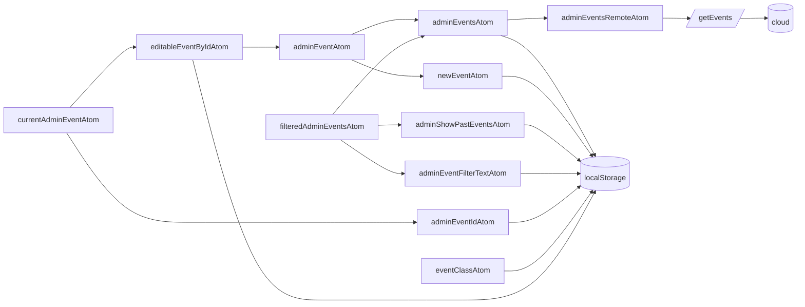
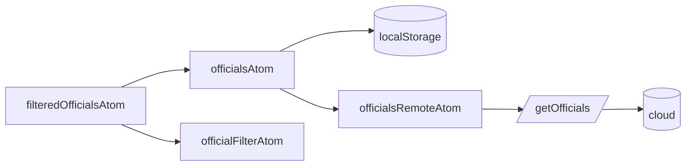
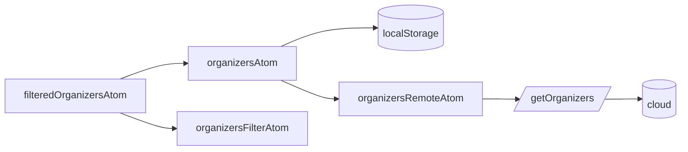
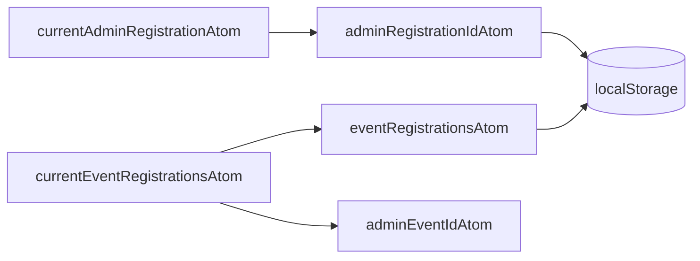

# State available to authenticated users

These flowcharts describe the relationship between source atoms, derived atoms, remote atoms, and persistent storage.

Derived atoms that combine state from multiple admin domains live in the parent `derivedAtoms.ts` module. Feature folders own
their source, editable, remote, and derived atoms alongside actions for that domain.

## Events

## Officials

## Organizers

## Registrations

