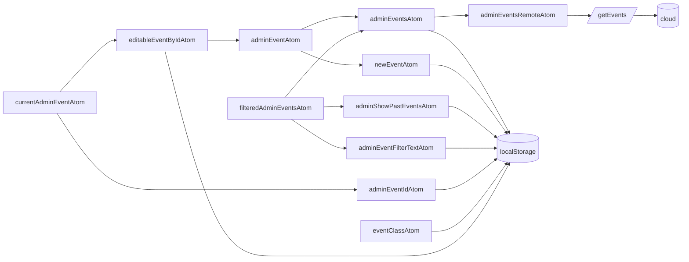
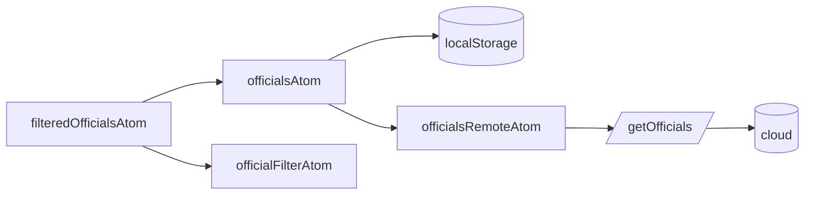
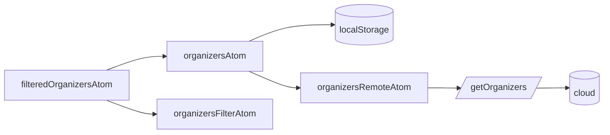
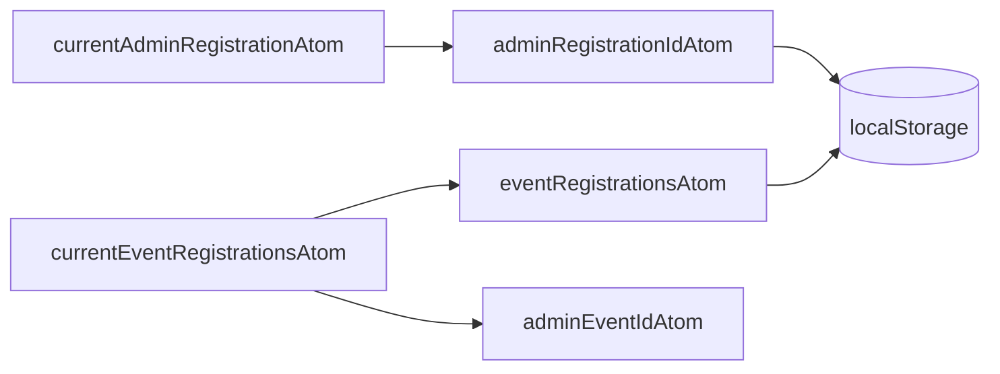

# State available to authenticated users

These flowcharts describe the relationship between source atoms, derived atoms, remote atoms, and persistent storage.

Derived atoms that combine state from multiple admin domains live in the parent `derivedAtoms.ts` module. Feature folders own
their source, editable, remote, and derived atoms alongside actions for that domain.

## Writes go through actions

A component never calls a write in `src/api` itself: it calls an action (`useAdminEventActions`,
`useAdminRegistrationActions`, `useSaveEventResults`), and the action calls the API and stores what
came back in the atoms. That is what keeps the screen that wrote showing what it wrote without
waiting for its own change to come back over the socket, and what keeps the cached and the stored
state the same thing (KOE-1343). Reads that touch no atom — an audit trail, a token link, a search —
may call the API directly. An actions hook subscribes to nothing asynchronous and needs no router:
it reads the selected event, the calendar and the user through `useAtomCallback` when an action
runs, so any view can hold it without suspending, and navigation after an action is the view's.

## Event scope

The families keyed by an event (`adminEventAtom`, `adminEventRegistrationsAtom`, the editable
copies, ...) hold one instance per event ever opened. Every page that opens an event claims it with
`useAdminEventScope(eventId)`; a moment after the last such page unmounts, `releaseAdminEventAtoms`
drops the event's instances from every family, and the next visit builds them again from storage and
the server. Add a new event-keyed family to `eventScope.ts`, or it leaks.

## Event view dialogs

`adminEventViewDialogAtom` (`eventViewDialog.ts`) holds which of the event page's dialogs is open,
and what it was opened for. The page renders the dialogs; the buttons that open them are in the entry
lists and the info panel, and call `useOpenEventViewDialog()` instead of receiving a setter through
every component in between (KOE-1347).

## Events

## Officials

## Organizers

## Registrations

