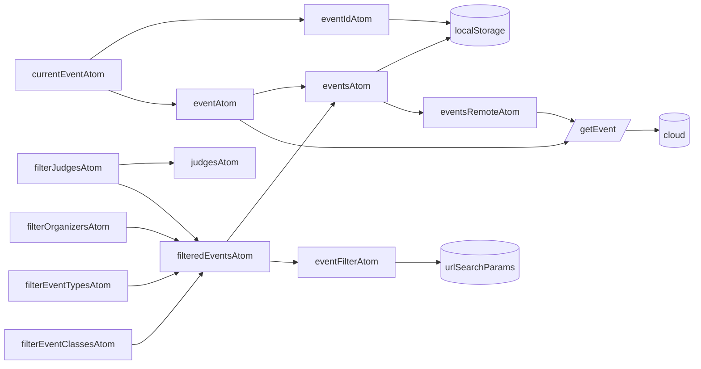
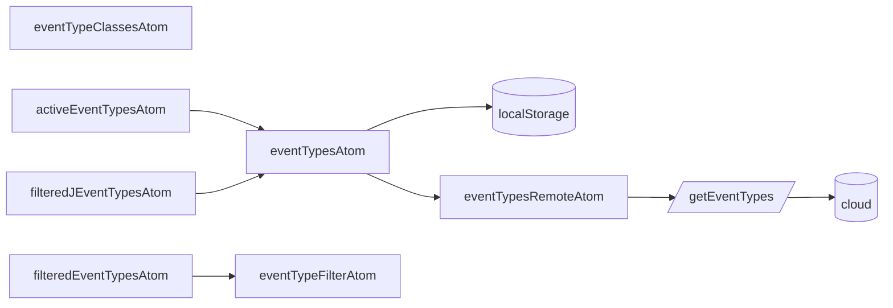
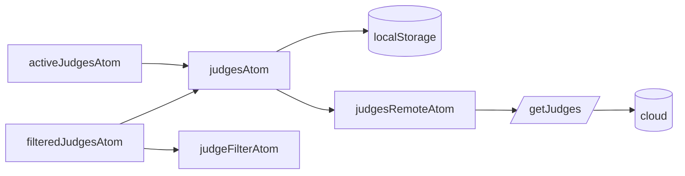
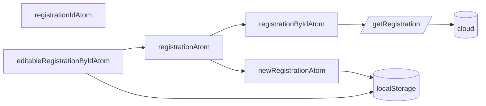

# State available to everyone

These flowcharts describe the relationship between source atoms, derived atoms, remote atoms, and persistent storage.

## Events

## EventTypes

## Judges

## Registration

